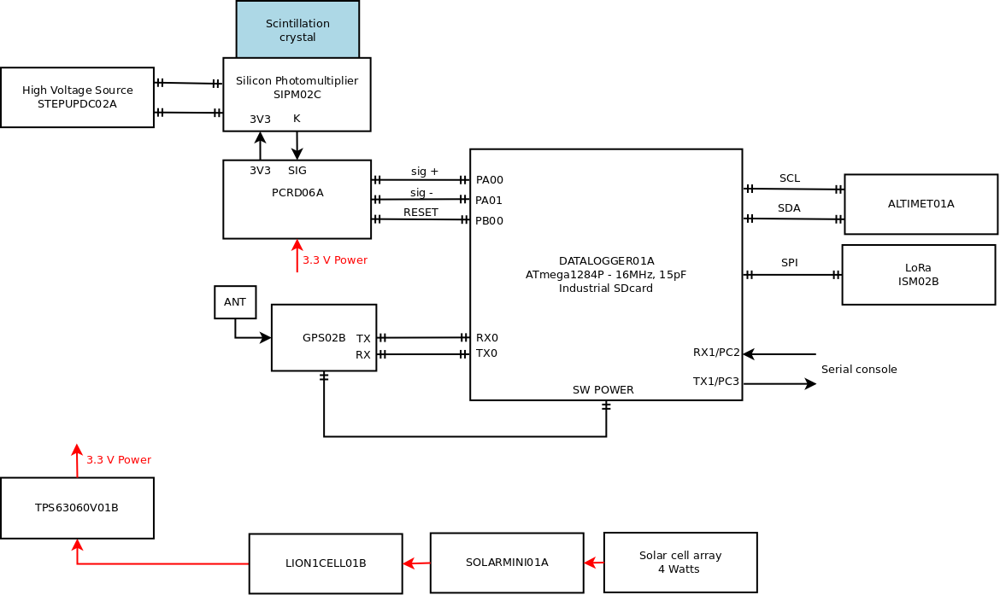

# GEODOS01B - Stand alone ionizing radiation monitor

*Open-source scintillation detector of ionizing radiation. The device can be further modified according to specific requirements. Character of its construction makes it especially suitable for placement into mountaints for in-field measurements*

If you need a fully automatic ionising radiation dosimeter-spectrometer device (with an internal logging and a backup power supply) or device designed for outdoor use without the possibility of connecting to power supply and data network [GEODOS01](https://github.com/UniversalScientificTechnologies/GEODOS01) might be a better option. We can help you in choosing the most suitable device or even design and develop a new one according to you requirements. In either case, reach us using email [support@ust.cz](mailto:support@ust.cz).

### Locations

GEODOS devices are mounted on multiple significant locations around Europe at this moment.

#### Chernobyl Red Forest

One GEODOS device is installed in [Chernobyl Red Forest site](https://en.wikipedia.org/wiki/Red_Forest).

#### Šumava mountains

GEODOS devices are installed on multiple locations in Šumava. For example example at [Polednik watch tower](https://cs.wikipedia.org/wiki/Poledn%C3%ADk_(%C5%A0umava)).

#### Kosetice Atmospheric Tower

The [National Atmospheric Observatory Košetice](https://actris-ri.cz/) (NAOK) was established by the Czech Hydrometeorological Institute as a department specialized in long-term air quality monitoring and research at the background scale in 1988. The GEODOS is located here by [CRREAT project](http://www.ujf.cas.cz/en/research-development/large-research-infrastructures-and-centres/crreat/objectives/).

### Technical parameters

* Detection element: scintillation crystal NaI(Tl) 10 mm in diameter, 20 mm in length, integrated with SiPM detector
* Power source: solar panel
* Backup power source: rechargable 18650 Li-ion cell
* Data memory: SD card
* Record’s content: energy and time of each event above the specified energy (1MeV by default)
* Record’s periodicity: 10 s (maximal dead time 2 s)
* Time resolution: 20 us
* ADC Conversion time: 104 us
* [Dead time](https://en.wikipedia.org/wiki/Dead_time): 2 us
* Accuracy of event’s time: 500 ns
* Energy range: 0.3 to 1 MeV (0,2 MeV resolution). The range could be increased up to 40 MeV by component values selection.
* Open-source HW and SW
* Device status indicator type: LED
* Uniterrupted measurement campaign interval is limited by SDcard capacity, if sufficient power is available during the whole period
* LoRa connection to IoT network
* Operational temperature range: -20°C to +35°C
* Charging temperature range: 0°C to +45°C (the internal backup Li-ion cell is not recharged outside of this range )
* Weather resistivity IP 65

### Device block diagram

### Sensor element

The core of the detector is a scintillation crystal with [SiPM detector](https://en.wikipedia.org/wiki/Silicon_photomultiplier).

### Data storage

The primary raw data is stored in SDcard's memory. The IoT network is used for telemetry data transfer, device monitoring (e.g. temperature, humidity, pressure, battery voltage etc.). We are normally using the [TTN](https://www.thethingsnetwork.org/), but the device could be configured for use with any IoT LoRa based network.
For remote areas, mounting a IoT gateway in radio range of GEODOS instruments could also be a good option.

### Detailed documentation of the used electronic modules

* [STEPUPDC02A](https://github.com/mlab-modules/STEPUPDC02)
* [SIPM02C](https://github.com/mlab-modules/SIPM02) known as "AIRDOSC01A_PCB01C"
* [PCRD06A](https://github.com/mlab-modules/PCRD06)
* [GPS01B](https://www.mlab.cz/module/GPS01B)
* [DATALOGGER01A](http://mlab.cz/module/DATALOGGER01A)
* [ALTIMET01A](https://github.com/mlab-modules/ALTIMET01)
* [ISM02B](https://github.com/mlab-modules/ISM02)
* [TPS63060V01A](https://github.com/mlab-modules/TPS63060V01)
* [LION1CELL01B](https://github.com/mlab-modules/LION1CELL01)
* [SOLARMINIBAT01A](https://github.com/mlab-modules/SOLARMINIBAT01)
* [SOLARMINI01B](https://github.com/mlab-modules/SOLARMINI01)
